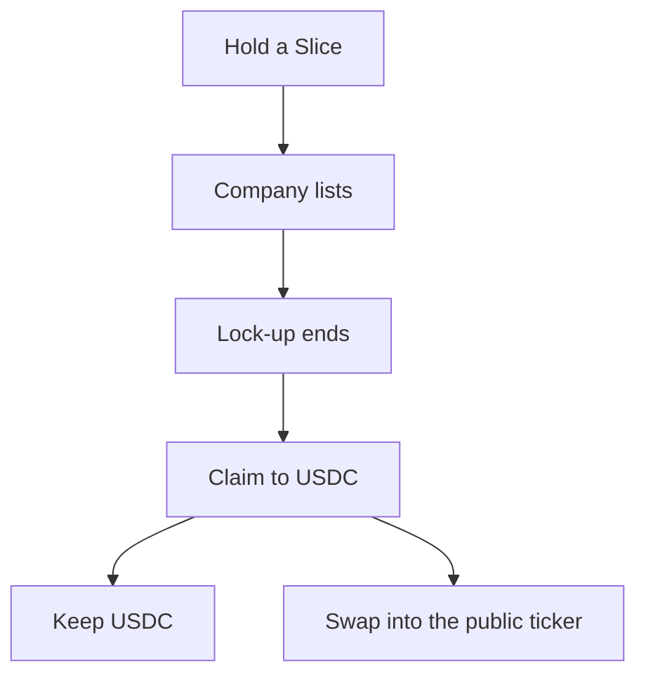

<Info>
  **Quick answer:** You hold a **Slice** while a name is still private. An IPO is not a payout. After the lock-up on WLTH's position ends, open **Portfolio**, tap **Claim**, and the Slice converts to **USDC**. Keep the USDC, or swap it into the **public ticker** in the same wallet — for example **SPCX**. Public tickers on WLTH run through our partner [ST0x](https://www.st0x.io/).
</Info>

A listing used to mean starting over at a new broker. On WLTH the next step stays in the app you already use.

This page is the product path. For the lock-up calendar itself, read [Pre-IPO to Public](/investment/exclusive-access/pre-ipo-to-public).

## The path

1. **Hold a Slice** while the name is still private.
2. **The company lists.** That is the IPO. It is not a payout.
3. **The lock-up on WLTH's position ends.** That is unlock. It can be a single date or a staggered release.
4. **Claim** the Slice from Portfolio. Proceeds land as USDC.
5. **Stop at USDC**, or **swap** into the public ticker (SPCX, or another name ST0x lists). Both sit in the same wallet.

## Slice vs public ticker

These are two different instruments. Same app. Same wallet. Not the same thing.

|  | **Slice** | **Public ticker** |
| --- | --- | --- |
| When | The name is still private | The name already trades publicly |
| What it is | An ERC-721 NFT. Tokenised economic exposure to a WLTH deal, backed 1:1 by the position in the SPV | The public ticker in the app (for example **SPCX**), issued on ST0x rails |
| What it is not | Shares or equity in the target company. No shareholder vote at that company | A brokerage share certificate in your name |
| How you exit | Sell the Slice on the marketplace, or claim to USDC after unlock | Swap or trade the ticker versus USDC |
| Where it sits | Portfolio, as a Slice | **My tokenized assets**, same wallet |
| Rails | WLTH Slice / SPV | [ST0x](https://www.st0x.io/) |

A Slice is your exposure while the name is private. The public ticker is the next leg, if you choose it. USDC is the bridge.

<Note>
  The walkthrough uses an **xAI Slice** claimed to USDC, then a swap into **SPCX**. Claim does not have to land in the same name. You can keep USDC, or swap into any public ticker the app offers.
</Note>

## How ST0x fits in

The public-ticker leg is not a second WLTH Slice. It runs through [**ST0x**](https://www.st0x.io/), our partner for tokenised public-market names.

WLTH is the app you stay in: Portfolio, Claim, Swap, the same wallet. ST0x is the infrastructure behind the public ticker.

What that means in practice:

- Public names trade on **Base** versus **USDC**, inside the WLTH app.
- You use the **same ticker** the market uses. SpaceX on the public side is **SPCX**, not a separate wrapped label.
- ST0x issues the token under an FMA-approved EU base prospectus. Each token carries a **Right of Exchange**: a contractual right to delivery of the corresponding security, on the terms in the Base Prospectus and Final Terms.
- That is not the same as a share certificate sitting in a brokerage account in your name. Read the ST0x terms before you swap.

ST0x also lists other public names besides SPCX. After a claim, you pick from what the app is offering that day.

## How to claim

Start in [Portfolio](https://app.wlth.xyz). Claim is the button. The screens after that are the claim result and the optional swap.

<Steps>
  <Step title="Open Portfolio">
    Go to Portfolio in the [WLTH app](https://app.wlth.xyz). Find the Slice that has unlocked.
  </Step>
  <Step title="Tap Claim">
    Open that Slice and tap **Claim**. Your wallet asks you to confirm.
  </Step>
  <Step title="USDC lands">
    The Slice converts to USDC. The confirmation screen shows the claimed amount and a **Buy** button for a public ticker if one is available (the example is **Buy SPCX** after a 100 USDC claim).
  </Step>
  <Step title="Keep USDC, or swap">
    You do not have to swap. If you do, USDC goes into the public ticker. The example swap is **20 USDC → SPCX**.
  </Step>
  <Step title="Check My tokenized assets">
    The public ticker shows on the same company page under **My tokenized assets**. The Slice row and the public-ticker row can sit on one screen. Same wallet. Two instruments.
  </Step>
</Steps>

<Tip>
  After claim, USDC is yours. Swapping into a public ticker is a second, optional trade on ST0x rails. It is not automatic and it is not a share certificate.
</Tip>

## What does not happen at IPO

An IPO is a liquidity event for the company. It is not automatically a liquidity event for your Slice.

- The lock-up on the **underlying position** has to end first. That can be a 180-day cliff or a staggered release.
- Claim opens when that unlock is live for your Slice. Not on listing morning by default.
- You can still list a Slice on the marketplace **before** unlock if fund terms allow and a buyer exists. That is a sale of the Slice, not a claim.

Read [Pre-IPO to Public](/investment/exclusive-access/pre-ipo-to-public) for how lock-ups work, and [liquidity and lockups](/investment/guides/liquidity-lockups-and-trading-slices) for marketplace sales.

## What you can do after claim

| You do this | You now hold |
| --- | --- |
| Claim and stop | USDC |
| Claim, then swap | The public ticker (for example SPCX) |
| Sell the Slice before unlock | USDC from the buyer, if someone bids |
| Do nothing after unlock | The unlocked Slice, until you claim or sell |

## Related pages

- [How WLTH Slices work](/investment/guides/how-wlth-slices-work)
- [Pre-IPO to Public](/investment/exclusive-access/pre-ipo-to-public)
- [Buying and selling Slices](/investment/slices/buying-and-selling-slices)
- [Pre-IPO Access](/investment/exclusive-access/pre-ipo-access)
- [ST0x](https://www.st0x.io/)

## FAQ

<AccordionGroup>
  <Accordion title="Is a public ticker the same as buying the stock?">
    No. A Slice is tokenised economic exposure to a still-private deal. A public ticker on WLTH (SPCX, and other names) is issued on ST0x rails. Neither one is a share certificate in your name, and neither one makes you a shareholder in the target company.
  </Accordion>

  <Accordion title="What is ST0x?">
    [ST0x](https://www.st0x.io/) is WLTH's partner for tokenised public-market names. They issue the public ticker, hold the legal structure behind it, and provide the Base / USDC trading rails. WLTH is where you claim the Slice and, if you want, swap into that ticker.
  </Accordion>

  <Accordion title="Do I have to swap after I claim?">
    No. Claim turns the Slice into USDC. Swap is a separate step. You can hold the USDC.
  </Accordion>

  <Accordion title="Does claim always buy the same company I held as a Slice?">
    No. The example is an xAI Slice claimed to USDC, then a swap into SPCX. You pick the public ticker the app offers. It can be a different name.
  </Accordion>

  <Accordion title="When can I claim?">
    After the lock-up on WLTH's position has ended and the claim window is open for that Slice. An IPO announcement alone does not open claim.
  </Accordion>

  <Accordion title="Can I claim only part of a Slice?">
    Follow the amount shown on the Claim screen for that Slice. If you need a smaller position before unlock, [split](/investment/slices/splitting-slices) or [sell](/investment/slices/buying-and-selling-slices) first, when those actions are available.
  </Accordion>

  <Accordion title="Where does the public ticker live?">
    In the same WLTH wallet, under **My tokenized assets** on the company page. You do not open a brokerage account to hold it.
  </Accordion>
</AccordionGroup>

<Warning>
  This page is informational. It is not financial, legal, or tax advice. A Slice is tokenised economic exposure, not direct equity in the target company. Public tickers on ST0x rails can fall in value, including to zero. Read the deal terms, the ST0x prospectus, and the public-ticker terms before you claim or swap. Availability varies by jurisdiction.
</Warning>