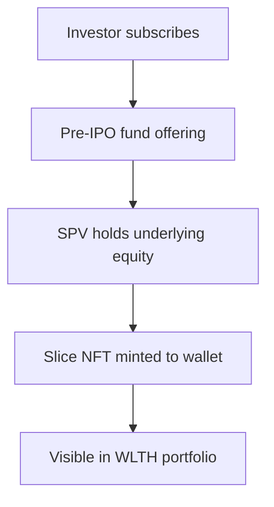

<Info>
  **Quick answer:** A **Slice** is an ERC-721 NFT on Base that represents your proportional share of a pre-IPO fund offering. Each Slice is **1:1 backed** by underlying equity in a separate legal structure. You can **hold, trade, or split** Slices when fund rules allow. Payouts from exits arrive in **USDC**.
</Info>

Slices are how WLTH turns illiquid private-market allocations into **fractional, transparent, tradable** positions. Instead of locking capital for years with no exit path, eligible holders can list Slices on the WLTH marketplace when fund terms and buyer demand allow.

## What is a Slice?

A Slice is a **tokenized unit of ownership** representing your exact share in a deal or fund:

- Standard: **ERC-721** NFT on **Base** (Ethereum L2)
- Economic meaning: **tokenized economic exposure** to underlying pre-IPO equity
- Not direct stock: no shareholder voting rights in the target company
- Backing: **1:1** with equity held in an SPV or fund structure per offering documents

## How Slices are created

1. You **subscribe** to a live pre-IPO offering on WLTH.
2. Capital flows into a **fund structure** that holds verified underlying equity.
3. You receive a **Slice NFT** proportional to your investment.
4. Slice metadata records your share, voting weight on exits, and status updates.

## What you can do with a Slice

| Action | Description |
| --- | --- |
| **Hold** | Maintain exposure until IPO, M&A, dividend, or other liquidity event |
| **Trade** | List on the WLTH marketplace when fund terms permit ([how to sell](/investment/slices/buying-and-selling-slices)) |
| **Split** | Divide a Slice into smaller parts ([splitting Slices](/investment/slices/splitting-slices)) |
| **Gift** | Send a Slice to another person by email ([gifting Slices](/investment/slices/gifting-slices)) |
| **Vote** | Participate in community-led exit votes per deal terms |

## Payouts and exits

- **Distributions** from dividends, partial exits, or full exits are paid in **USDC** to your wallet.
- **Exit votes:** Slice holders may vote on liquidity opportunities per deal terms.
- **Partial exits:** Slice metadata updates to reflect your remaining share.
- **Full exits:** Slice may be marked complete after final distribution.

## Liquidity: what "tradable" really means

Slices are **designed** for flexibility, but liquidity is **conditional**:

- Fund-level **lockups** may block transfers after subscription.
- You need a **willing buyer** on the marketplace.
- WLTH does **not** guarantee bids or repurchase your Slice.

Read the full [liquidity and lockups guide](/investment/guides/liquidity-lockups-and-trading-slices).

## WLTH Slice vs traditional private fund interest

| Topic | Traditional fund interest | WLTH Slice |
| --- | --- | --- |
| Proof of ownership | Paper / custodian records | On-chain NFT on Base |
| Minimum | Often $10,000+ | From **$20** |
| Secondary sales | Rare, negotiated | Marketplace when eligible |
| Payouts | Fund admin distribution | USDC to wallet |
| Transparency | Periodic statements | On-chain provenance + app portfolio |

## Security and custody

- WLTH is **non-custodial**. Smart contracts handle transfers; WLTH does not hold your assets.
- Use **2FA** and consider a hardware wallet for larger holdings.
- Review [security best practices](/security-and-technology/security-best-practices).

## Related pages

- [Slices overview](/investment/slices)
- [Buying and selling Slices](/investment/slices/buying-and-selling-slices)
- [Pre-IPO Access](/investment/exclusive-access/pre-ipo-access)
- [Support FAQ](/support/faq)

## FAQ

<AccordionGroup>
  <Accordion title="Is a Slice the same as a share of stock?">
    No. A Slice represents tokenized economic exposure through a fund structure. It is not a registered share on a public exchange.
  </Accordion>
  <Accordion title="Are Slices backed by real equity?">
    Yes. Each Slice is backed 1:1 by equity held in a separate legal structure per offering terms.
  </Accordion>
  <Accordion title="Can I sell my Slice anytime?">
    When fund terms allow and a buyer exists, yes, via the WLTH marketplace. Lockups and low demand can prevent sales.
  </Accordion>
  <Accordion title="What blockchain are Slices on?">
    Base (Ethereum L2), as ERC-721 NFTs.
  </Accordion>
  <Accordion title="How do I buy my first Slice?">
    Create an account, fund with USDC, browse [Pre-IPO Access](https://app.wlth.xyz/companies), and invest from $20.
  </Accordion>
  <Accordion title="What fees apply?">
    Fees vary by offering and marketplace activity. See fund disclosures and [staking and fees](/investment/staking-and-fees) for platform context.
  </Accordion>
</AccordionGroup>
