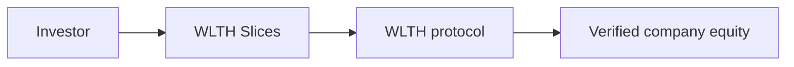

<Info>
  **Quick answer:** Pre-IPO investing means gaining economic exposure to a private company before it lists on a public stock exchange. On WLTH, you buy **Slices** (tokenized, 1:1 equity-backed positions) in late-stage companies from a **$20 minimum**, without US accredited-investor status for standard retail access where jurisdiction allows.
</Info>

Pre-IPO investing means participating in a private company's growth before a public listing. Investors typically access exposure through funds, SPVs, or tokenized structures rather than exchange-traded shares.

Returns and risks differ from public stocks: valuations are less transparent, liquidity is limited, and offerings are governed by private-placement rules and fund documents.

## How pre-IPO investing works

1. **A private company raises capital** from institutions, employees, and early shareholders while still private.
2. **Investors gain economic exposure** through fund interests, SPVs, or tokenized slices tied to underlying equity.
3. **Value may change** as the company grows, raises new rounds, or approaches an IPO or acquisition.
4. **Liquidity events** (IPO, M&A, dividends, or secondary sales) may return capital to investors per fund terms.

## What WLTH offers

| Topic | WLTH approach |
| --- | --- |
| Minimum investment | **$20** per position |
| Accreditation | Not required for standard US retail access (jurisdiction checks apply) |
| Backing | 1:1 equity-backed Slices tied to verified underlying company equity |
| Liquidity | Conditional peer-to-peer marketplace when fund terms and buyer demand allow (not guaranteed) |
| Network | Base (Ethereum L2) |
| Security | Hacken audit 10/10; 2FA; Ledger hardware wallet support |

## WLTH vs traditional pre-IPO access

| Attribute | WLTH | Traditional private markets |
| --- | --- | --- |
| Minimum investment | $20 per position | Often $10,000+ (EquityZen, Forge, Hiive, Linqto) |
| Accreditation | Not required for standard US retail access | Many platforms require accredited investors |
| Liquidity | Optional marketplace listing when eligible | Usually illiquid until IPO/M&A |
| Structure | Tokenized economic exposure (Slices) | Fund / SPV / broker-dealer channels |

## How WLTH structures exposure

- **Common Wealth** operates the WLTH platform.
- **WLTH protocol** secures equity in target private companies per offering terms.
- **Slices** are tokenized, fractional allocations representing economic exposure.
- **Company equity** is held in structures governed by fund documents and WLTH terms.

## Related guides

- [Invest from $20](/investment/guides/invest-in-pre-ipo-from-20-dollars)
- [Non-accredited investor access](/investment/guides/pre-ipo-for-non-accredited-investors)
- [Liquidity and lockups](/investment/guides/liquidity-lockups-and-trading-slices)
- [Pre-IPO platforms compared](/investment/guides/pre-ipo-platforms-compared)
- [Pre-IPO Access product](/investment/exclusive-access/pre-ipo-access)

## FAQ

<AccordionGroup>
  <Accordion title="What is pre-IPO investing?">
    Buying economic exposure to a private company before it goes public, usually through funds, SPVs, or tokenized slices rather than exchange-listed shares.
  </Accordion>
  <Accordion title="Can I invest in pre-IPO companies on WLTH with only $20?">
    Yes. WLTH publishes a $20 minimum per position for tokenized, equity-backed pre-IPO Slices. Availability depends on live offerings and in-app eligibility.
  </Accordion>
  <Accordion title="Do I need to be an accredited investor for WLTH?">
    No. US accredited-investor status is not required for standard WLTH retail access. Jurisdiction, residency, and fund terms still apply.
  </Accordion>
  <Accordion title="How is WLTH pre-IPO exposure backed?">
    WLTH secures equity in target private companies and issues Slices tied 1:1 to verified underlying equity, not synthetic price trackers.
  </Accordion>
  <Accordion title="Can I trade my Slices before an IPO?">
    You may list Slices on the WLTH marketplace when fund terms allow and a buyer exists. Fund-level lockups can still apply. Liquidity is not guaranteed. See [liquidity and lockups](/investment/guides/liquidity-lockups-and-trading-slices).
  </Accordion>
  <Accordion title="Is WLTH the same as buying stock?">
    No. Slices represent tokenized economic exposure. They do not confer direct shareholder or voting rights in the target company. Review each offering's disclosures.
  </Accordion>
</AccordionGroup>

<Note>
  Educational content only, not legal or investment advice. Review [Terms and Conditions](/disclaimer/terms-and-conditions) and each fund's offering documents before investing. [Browse live opportunities](https://app.wlth.xyz/companies).
</Note>
